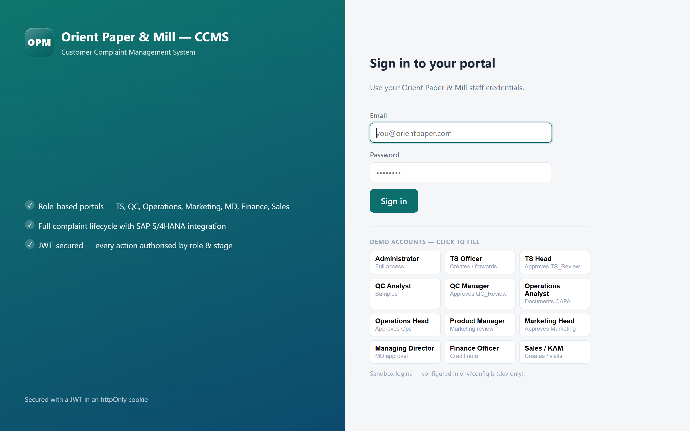
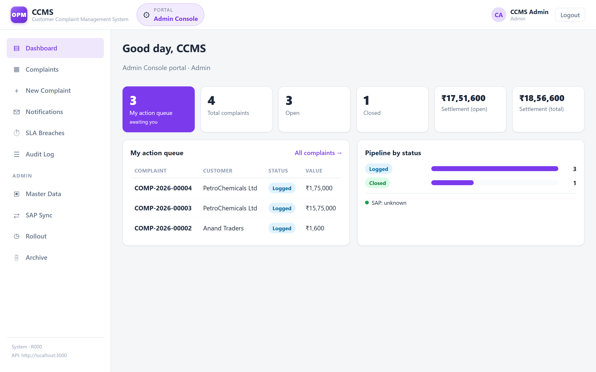
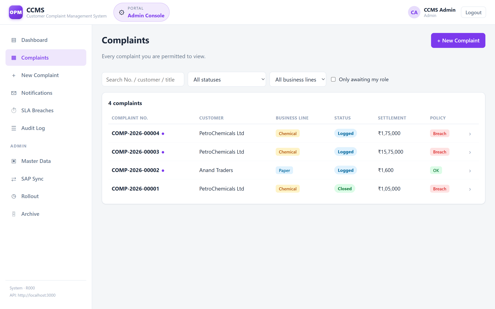
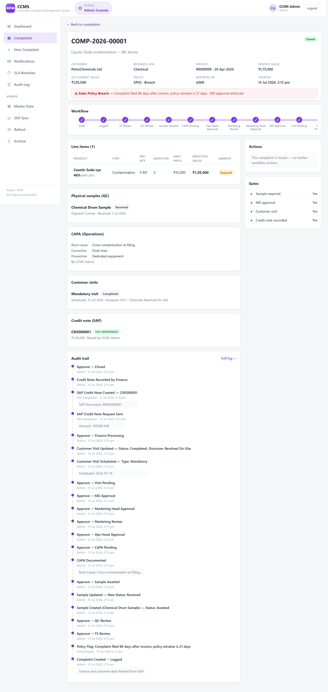
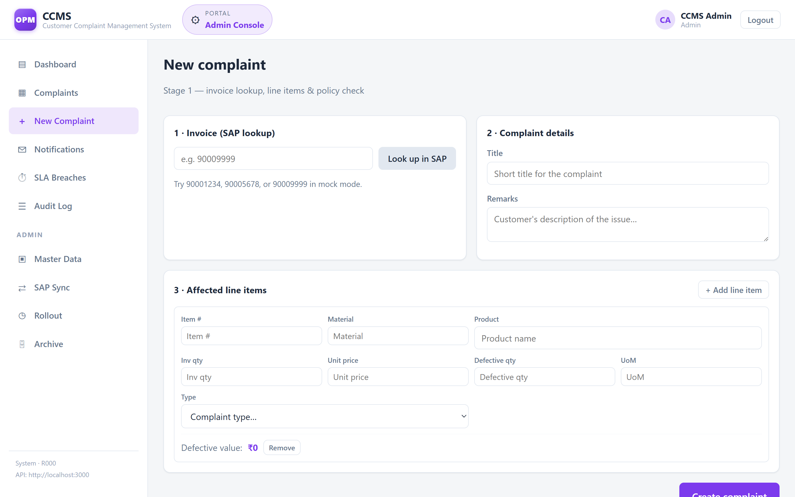
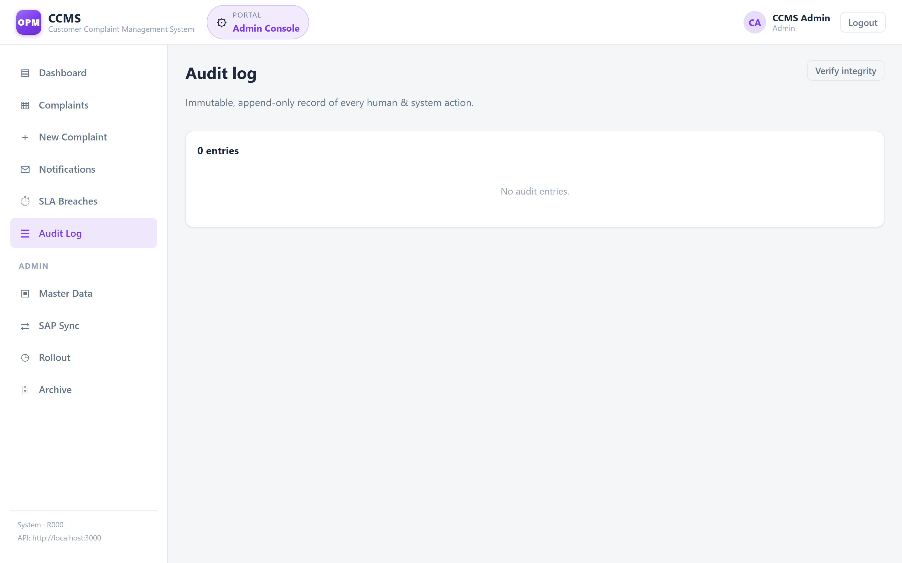

# CCMS
## Customer Complaint Management System — Orient Paper & Mill
### Complaint Transaction + SAP S/4HANA Data Push · `backend/` + `frontend/`

---

## What This System Does

This is the complete backend for the Orient Paper & Mill CCMS — built exactly to the **CCMS Data Classification Report & Addendum** spec. It covers:

> **Documentation** — [Architecture](docs/ARCHITECTURE.md) · [API Reference](docs/API.md) · [Database](docs/DATABASE.md) · [Security](docs/SECURITY.md)

| Area | What's Built |
|---|---|
| **Persistence** | PostgreSQL — 18 tables. Money is `numeric`, defective value is a generated column, all 16 workflow statuses are CHECK-constrained, and the audit log is append-only at the database level |
| **Master Data** | 9 entities: Customer/Distributor, User, Role, Department, Product/SKU, Invoice, Complaint Type, Sample Type, Sales Policy |
| **Complaint Transaction** | Full Stage 1–8 lifecycle with all gates, approvals, and side-states |
| **SAP Integration** | All 6 touchpoints from Section 11.1 — real-time invoice lookup, nightly master data batch sync, Credit Note push and writeback |
| **Workflow Engine** | 13-status state machine (Section 8) with universal transition rule |
| **Sample Tracking** | Section 6 — physical sample lifecycle with QC gate |
| **Customer Visits** | Section 7 — mandatory/optional visit records with outcome tracking |
| **CAPA** | Corrective & Preventive Action documentation by Operations |
| **Audit Log** | Immutable, append-only log of every human and system action (Section 12.6) |
| **Sales Policy** | Section 9 — policy compliance check at Stage 1; policy breach triggers MD approval |

---

## Screenshots

### Sign in — one system, a portal per role
Each role gets its own accent colour and navigation. The sandbox logins below
the form are dev-only and disappear when `SHOW_DEMO_ACCOUNTS` is off.



### Dashboard — your action queue first
KPI tiles split settlement into **open exposure** vs **lifetime total**, and the
action queue shows only complaints this role can act on right now.



### Complaints — scoped to what you're allowed to see
Read scoping is enforced by the API, not the UI: a junior role never receives
complaints outside its queue. Policy breaches are flagged inline.



### Complaint detail — the whole journey on one page
Workflow tracker, gate status, line items with auto-computed defective value,
samples, CAPA, visits, the SAP credit note, and the full immutable audit trail.



### New complaint — invoice pulled live from SAP
Enter an invoice number and SAP returns the header and line items; you add the
defective quantity and complaint type. Settlement value drives the MD and visit
gates automatically.



### Audit log — every human and system action
Append-only, checksummed, and enforced at the database level. `Policy Engine`
and `SAP Integration` appear as actors alongside people.



---

## Quick Start

The project is split into **`backend/`** (Express API + PostgreSQL) and
**`frontend/`** (static SPA).

### Prerequisites

| | |
|---|---|
| **Node.js** | 18 or newer |
| **PostgreSQL** | 13 or newer, running locally (default port `5432`) |

You need the PostgreSQL **server** running; the `psql` CLI is *not* required —
setup goes through the Node driver.

### 1. Backend (terminal 1)

```bash
cd backend
npm install                  # first time only
cp .env.example .env         # first time only
#   → open .env and set PGPASSWORD to your PostgreSQL password
npm run init-db              # creates the `ccms` database, schema + seed data
npm start                    # → http://localhost:3000  (MOCK SAP mode)
```

`npm run init-db` is safe to re-run: it refuses to touch a database holding
any transactional data — complaints, line items, attachments, samples, visits,
CAPA records, credit notes, or the audit trail. Master data is reseeded from
`seed.sql`, so a re-run costs nothing there. To deliberately wipe and rebuild:

```bash
npm run init-db -- --force   # drops every table, then recreates and reseeds
```

### 2. Frontend (terminal 2)

```bash
cd frontend
cp env/config.example.js env/config.js   # first time only
node serve.js                            # → http://localhost:5173
```

Then open **http://localhost:5173** and sign in.

### Default logins

Seeded by `init-db`. Admin can drive every stage of the workflow.

| Role | Email | Password |
|---|---|---|
| Administrator | `admin@orientpaper.com` | `Admin@456` |
| All other staff | see `db/seed.sql` | `Orient@123` |

> **These are sandbox credentials, and this repository is public — so they are
> public too.** That is fine on a laptop and not fine anywhere reachable.
>
> Seeding with `NODE_ENV=production` handles it: `init-db` gives every account
> still carrying a password published here a fresh random one and prints them
> once. Nothing in this repository can then sign in to that database.

Only the hash is stored, so a password can never be read back. Lost one — or
want to rotate — without touching any data:

```bash
npm run reset-password -- admin@orientpaper.com   # one account
npm run reset-password -- --all                   # every account
npm run reset-password -- --published             # only accounts still using a
                                                  # password published in this repo
```

Restart the API afterwards: it caches users at startup, so a running server
still expects the old password.

**To connect real SAP later:** set `SAP_USE_MOCK=false` in `backend/.env` and
fill in the 4 SAP lines. Zero code changes anywhere else.

### Troubleshooting

| Symptom | Fix |
|---|---|
| `[DB] startup failed` on `npm start` | Postgres isn't running, or `.env` credentials are wrong |
| `relation "complaints" does not exist` | You skipped `npm run init-db` |
| `EADDRINUSE :::3000` | Another backend is already running on port 3000 |

---

## Project Structure

```
CCMS/
├── backend/                       ← Express API + PostgreSQL
│   ├── db/                            ← Database (run: npm run init-db)
│   │   ├── schema.sql                 ← 18 tables: constraints, FKs, triggers
│   │   ├── seed.sql                   ← Master data (idempotent)
│   │   └── init.js                    ← One-command setup: create + schema + seed
│   ├── src/
│   │   ├── db/pool.js                 ← Connection pool, query helpers, type parsers
│   │   ├── data/
│   │   │   ├── masterData.js          ← 9 master entities, cached at boot (Sections 3, 6.2, 9.1)
│   │   │   ├── transactionalStore.js  ← 7 transactional entities, async (Section 4, 6.3, 7.1)
│   │   │   └── auditLog.js            ← Append-only audit log (Section 8.2, 12.6)
│   │   ├── services/
│   │   │   ├── sapService.js          ← All 6 SAP integration touchpoints (Section 11)
│   │   │   └── workflowService.js     ← 13-state machine + universal transition rule (Section 8)
│   │   ├── routes/
│   │   │   ├── complaints.js          ← Full complaint lifecycle API (RBAC + read scoping)
│   │   │   └── masterData.js          ← Master data read + SAP sync trigger
│   │   ├── middleware/auth.js         ← JWT auth, RBAC, status gates
│   │   ├── utils/pagination.js        ← Bounded list responses
│   │   └── server.js                  ← Express entry point
│   ├── .env                       ← active config — GIT-IGNORED (holds DB password)
│   ├── .env.example
│   └── package.json
├── frontend/                      ← Static SPA (run: cd frontend && node serve.js)
│   ├── js/  css/  env/  index.html  serve.js  README.md
├── CCMS-OrientPaperMill.postman_collection.json
└── README.md
```

---

## Master Data Entities (Section 3, 6.2, 9.1)

### 1. Customers / Distributors
- Synced nightly from SAP Business Partner (API_BUSINESS_PARTNER)
- **Data isolation rule enforced**: each customer can only see their own invoices
- Key attributes: ID, Name, Type, Region, Segment, Business Line, Key Account flag, App Access (mobile)

### 2. Users
- Internal staff with Web App access
- Linked to Role and Department

### 3. Roles
- Defines authority levels (who can approve/reject/forward per stage)
- Roles: TS Officer, TS Head, QC Analyst, QC Manager, Operations Analyst, Operations Head, Product Manager, Marketing Head, MD, Finance Officer, Sales/KAM

### 4. Departments
- TS, QC, Operations, Marketing, MD Office, Finance, Sales

### 5. Products / SKUs
- Synced nightly from SAP Material Master (API_PRODUCT_SRV)
- **Product category (Paper/Chemical) drives workflow routing** to correct Product Manager at Stage 5

### 6. Invoices (Billing Documents)
- **Fetched real-time** from SAP at complaint creation (API_BILLING_DOCUMENT_SRV)
- Returns header + line items with Invoice Qty and Unit Price (auto-populated)
- Fallback: manual entry with "Pending SAP Validation" flag if SAP is unreachable

### 7. Complaint Types
- Nature of complaint per line item
- Includes `sampleRequired` flag that triggers the sample gate in QC Review

### 8. Sample Types *(Section 6.2 — new master entity)*
- Paper Roll Cutting, Ream Sample, Chemical Drum Sample, Packaging Sample, Lab Reference Sample
- Linked to Applicable Business Line

### 9. Sales Policies *(Section 9.1 — new master entity)*
- Synced nightly from SAP pricing condition records
- Key attributes: Max Settlement %, Complaint Window (days), Approval Override on Breach

---

## Transactional Entities (Section 4, 6.3, 7.1)

| Entity | Key Purpose |
|---|---|
| **Complaint** | Auto-generated Complaint Number; tracks status, settlement value, policy flag, gates |
| **Line Item** | Per invoice × per affected product; Defective Value auto-computed = Unit Price × Defective Qty |
| **Attachment** | Photos/videos per line item; uploaded at Stage 1 |
| **Sample Record** | Physical sample lifecycle: Awaited → Received → Under Testing → Tested → Disposed |
| **Visit Record** | Customer visit: Planned → Completed; with findings, outcome, customer acknowledgement |
| **CAPA Record** | Root Cause, Corrective Action, Preventive Action — documented by Operations at Stage 4 |
| **Credit Note** | SAP Credit Note number written back at closure; includes Notified To field |

---

## Workflow Status Sequence (Section 8)

```
Draft
  └─→ Logged              [Complaint submitted, Complaint No. generated, visible to TS]
        └─→ TS_Review
              └─→ QC_Review
                    └─→ [Sample_Awaited]   ← GATE: only if complaint type = sampleRequired
                          └─→ CAPA_Pending
                                └─→ Ops_Head_Approval
                                      └─→ Marketing_Review
                                            └─→ Marketing_Head_Approval
                                                  └─→ [MD_Approval]   ← GATE: settlement > ₹1L OR policy breach
                                                        └─→ [Visit_Pending]  ← GATE: key account OR settlement > ₹50K
                                                              └─→ Finance_Processing
                                                                    └─→ Closed
```

**Side-states** (reachable from any active status):
- `Rejected` → returns to previous status
- `Clarification_Sought` → pauses at current status, returns when resolved
- `Auto_Closed` → complaint auto-closed with remarks after defined period

**Gates:**
- **Sample Gate**: QC_Review cannot be approved until physical sample status = "Received" or beyond
- **MD Approval Gate**: triggered if `settlementValue > ₹1,00,000` OR `Sales Policy breach + approvalOverrideOnBreach=true`
- **Visit Gate**: triggered if customer `isKeyAccount=true` OR `settlementValue > ₹50,000` OR `visitRequested=true`
- **Finance Gate**: complaint cannot reach Closed unless Credit Note number exists in CCMS (confirmed from SAP)

---

## SAP Integration Touchpoints (Section 11.1)

| # | Touchpoint | Direction | Mode | API |
|---|---|---|---|---|
| 1 | Invoice lookup (Qty, Price) | SAP → CCMS | **Real-time** | API_BILLING_DOCUMENT_SRV |
| 2 | Customer/Distributor master | SAP → CCMS | Nightly batch | API_BUSINESS_PARTNER |
| 3 | Product/SKU master | SAP → CCMS | Nightly batch | API_PRODUCT_SRV |
| 4 | Sales Policy / pricing conditions | SAP → CCMS | Nightly batch | API_SLSPRICINGCONDITIONRECORD_SRV |
| 5 | Credit Note creation request | CCMS → SAP | **Real-time** | API_SALES_ORDER_SRV |
| 6 | Credit Note number write-back | SAP → CCMS | **Real-time** (response to #5) | — |

---

## Postman Test Sequence

### Complete lifecycle for a high-value Chemical complaint (triggers MD + Visit):

**Step 1 — Create Complaint**
```
POST http://localhost:3000/api/complaints
Content-Type: application/json

{
  "invoiceNumber": "90009999",
  "title": "Caustic Soda contamination — IBC drum batch",
  "remarks": "Customer reports off-colour and unusual odour from 3 IBC drums",
  "lineItemsInput": [
    {
      "invoiceItemNo": "10",
      "sapMaterialNo": "MAT-2001",
      "productName": "Caustic Soda Lye 48%",
      "invoiceQty": 5,
      "unitPrice": 35000,
      "defectiveQty": 3,
      "uom": "MT",
      "complaintTypeId": "CT06"
    }
  ],
  "reportedBy": "CUST-2000001"
}
```
→ Returns complaintNo (e.g. COMP-2026-00001). Note: settlementValue = 105,000 → **MD Approval triggered**. isKeyAccount=false but value > ₹50K → **Visit triggered**.

**Step 2 — TS Review**
```
POST /api/complaints/COMP-2026-00001/action
{ "action": "approve", "actorId": "U001", "actorRole": "TS Officer", "remarks": "Technical review complete. Contamination claim verified against batch records." }
```

**Step 3 — QC Review (try approve before sample — should be BLOCKED)**
```
POST /api/complaints/COMP-2026-00001/action
{ "action": "approve", "actorId": "U003", "actorRole": "QC Analyst" }
```
→ Returns 422 error: "physical sample has not been received yet"

**Step 4 — Create Sample Record**
```
POST /api/complaints/COMP-2026-00001/samples
{
  "sampleTypeId": "ST03",
  "dispatchMode": "Courier",
  "dispatchedDate": "2026-06-28",
  "createdBy": "U003"
}
```

**Step 5 — Update Sample: Received**
```
PUT /api/complaints/COMP-2026-00001/samples/{sampleId}
{ "sampleStatus": "Received", "receivedBy": "U003", "receivedDate": "2026-07-01" }
```

**Step 6 — Now QC can approve**
```
POST /api/complaints/COMP-2026-00001/action
{ "action": "approve", "actorId": "U003", "actorRole": "QC Analyst" }
```

**Step 7 — Document CAPA**
```
POST /api/complaints/COMP-2026-00001/capa
{
  "rootCauseDescription": "Cross-contamination during drum filling at Plant 2 on 2026-04-18. Sodium hypochlorite residue in shared filling hose.",
  "correctiveAction": "Immediate segregation of Chemical lines. Flush all shared equipment. Replace IBC drums from affected batch.",
  "preventiveAction": "Dedicated filling equipment per product line. Mandatory flush-verification checklist before every batch changeover.",
  "documentedBy": "U005",
  "documentedByName": "Rajesh Gupta"
}
```

**Step 8 — Approve through to Finance (6 more approves)**
```
POST /api/complaints/COMP-2026-00001/action  → { "action": "approve" }  (×6, each stage)
```
Stages: CAPA_Pending → Ops_Head_Approval → Marketing_Review → Marketing_Head_Approval → MD_Approval → Visit_Pending → Finance_Processing

**Step 9 — Schedule Customer Visit (while in Visit_Pending)**
```
POST /api/complaints/COMP-2026-00001/visits
{
  "scheduledDate": "2026-07-15",
  "assignedTo": "U011",
  "visitType": "Mandatory"
}
```

**Step 10 — Complete Visit**
```
PUT /api/complaints/COMP-2026-00001/visits/{visitId}
{
  "visitStatus": "Completed",
  "visitDate": "2026-07-15",
  "findings": "3 out of 5 IBC drums confirmed contaminated. Customer accepts replacement + credit for 3 MT.",
  "outcome": "Resolved On-Site",
  "customerAcknowledgement": "OTP-verified by Anil Kumar"
}
```

**Step 11 — Approve out of Visit_Pending → Finance_Processing**
```
POST /api/complaints/COMP-2026-00001/action
{ "action": "approve", "actorId": "U009", "actorRole": "Managing Director" }
```

**Step 12 — Finance raises Credit Note in SAP**
```
POST /api/complaints/COMP-2026-00001/credit-note
{
  "raisedBy": "U010",
  "raisedByName": "Anand Kulkarni",
  "reason": "3 MT Caustic Soda contamination — confirmed by QC and Operations"
}
```
→ SAP returns Credit Note number (e.g. CN5000001). Written back to complaint.

**Step 13 — Close complaint**
```
POST /api/complaints/COMP-2026-00001/action
{ "action": "approve", "actorId": "U010", "actorRole": "Finance Officer" }
```
→ Status: **Closed** ✅

**Step 14 — View full audit trail**
```
GET /api/complaints/COMP-2026-00001/audit-log
```

---

## Environment Variables Reference

| Variable | Default | Purpose |
|---|---|---|
| `PORT` | 3000 | Server port |
| `PGHOST` | localhost | PostgreSQL host |
| `PGPORT` | 5432 | PostgreSQL port |
| `PGDATABASE` | ccms | Database name (created by `npm run init-db`) |
| `PGUSER` | postgres | PostgreSQL user |
| `PGPASSWORD` | — | **Required.** Your PostgreSQL password — never commit it |
| `PG_POOL_MAX` | 10 | Max pooled connections |
| `SAP_USE_MOCK` | true | Switch to false for live SAP |
| `SAP_BASE_URL` | — | SAP Gateway base URL |
| `SAP_USERNAME` | — | SAP service account |
| `SAP_PASSWORD` | — | SAP service password |
| `MD_APPROVAL_THRESHOLD` | 100000 | ₹ amount triggering MD approval |
| `VISIT_THRESHOLD` | 50000 | ₹ amount triggering mandatory visit |
| `SAMPLE_SLA_DAYS` | 7 | Days before sample-awaited auto-escalation |
| `STAGE_SLA_DAYS` | 3 | Days before stage auto-escalation |
| `DEFAULT_COMPLAINT_WINDOW_DAYS` | 30 | Policy complaint window |

---

## IDE Setup

Use **VS Code** (download: https://code.visualstudio.com).

Recommended extensions:
- **Thunder Client** — test API calls directly in VS Code without Postman
- **ESLint** — catch JS errors as you type
- **DotENV** — syntax highlighting for .env
- **REST Client** — alternative API tester

For the SAP/ABAP side when you get SAP access: use **Eclipse IDE + ABAP Development Tools (ADT)** plugin — not VS Code.

---

<div align="center">

**Built by Keshav Raj Jain**

Customer Complaint Management System · Orient Paper &amp; Mill

</div>
