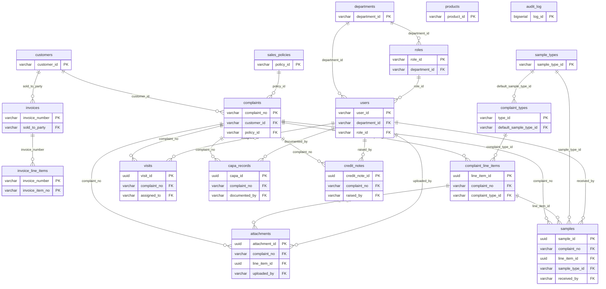

# Database

PostgreSQL. **18 tables**, 191 columns, 23 foreign keys.

Created by `npm run init-db` from [`backend/db/schema.sql`](../backend/db/schema.sql)
and seeded from [`backend/db/seed.sql`](../backend/db/seed.sql). This page is
generated from the schema file, so it cannot drift from the DDL.

---

## ER diagram

`complaints` is the hub: the process, financial and audit tables all hang off
it. `users` is the second hub — nearly every action records who did it.

---

## Conventions

| | |
|---|---|
| **Naming** | snake_case in SQL; queries alias back to camelCase so JS objects keep their shape |
| **Money** | `numeric(15,2)` — never float. `pg` returns numeric as a string, so `db/pool.js` installs a parser to get real numbers back |
| **Dates** | `DATE` is parsed as `'YYYY-MM-DD'` strings, not `Date` objects — a Date would land at *local* midnight and shift the calendar day either side of UTC |
| **Timestamps** | `timestamptz`, default `now()` |
| **Enums** | `CHECK` constraints rather than native `ENUM` — equally strict, far easier to change |
| **IDs** | Business keys where they exist (`complaint_no`, `customer_id`); `uuid` for child rows |

---

## Invariants the database enforces

These are **not** left to the application:

- **`complaint_line_items.defective_value`** is a generated column
  (`unit_price * defective_qty`). It cannot disagree with its inputs.
- **`complaint_no`** comes from the `complaint_no_seq` sequence. The old
  in-memory counter reset to `00001` on every restart, so duplicates were
  reachable.
- **`defective_qty <= invoice_qty`** — you cannot claim more defective units
  than were invoiced.
- **`closed_at`** may only be set when the status is actually terminal.
- **A sample can't be `Received`** without a `received_date`.
- **All 16 workflow statuses** are CHECK-constrained — a typo'd status is
  rejected rather than silently stored.
- **`audit_log` rejects UPDATE, DELETE and TRUNCATE** via triggers. See
  [SECURITY.md](SECURITY.md#audit-log).

---

## Notable design choices

**Snapshots on `complaints`.** `customer_name`, `customer_segment`,
`invoice_value` and `is_key_account` are copied, not just referenced. A
complaint must reflect the customer and invoice *as they were when filed* — if
SAP re-segments a customer later, an old complaint's policy decision must still
make sense.

**`audit_log` has no FK to `complaints`.** Deliberate: an audit trail must
outlive the record it describes. Deleting a complaint therefore does **not**
remove its trail — that has to be done explicitly.

**`last_sap_sync` on SAP-owned tables.** `customers`, `products`,
`sales_policies` and `invoices` are mastered in SAP; the column records when
CCMS last refreshed them.

---

## Tables

### Organisation & people

#### `departments`

| Column | Type | |
|---|---|---|
| `department_id` | varchar(10) | **PK** |
| `department_name` | varchar(100) | required |
| `code` | varchar(10) | required |

#### `roles`

| Column | Type | |
|---|---|---|
| `role_id` | varchar(10) | **PK** |
| `role_name` | varchar(60) | required |
| `department_id` | varchar(10) | FK → `departments` |
| `can_approve` | boolean | required |
| `can_forward` | boolean | required |
| `can_reject` | boolean | required |
| `level` | smallint | required |

#### `users`

| Column | Type | |
|---|---|---|
| `user_id` | varchar(10) | **PK** |
| `name` | varchar(100) | required |
| `department_id` | varchar(10) | FK → `departments` |
| `role_id` | varchar(10) | FK → `roles`, required |
| `email` | varchar(150) | required |
| `password_hash` | varchar(120) | required |
| `active` | boolean | required |
| `created_at` | timestamptz | required |

---

### Commercial master (SAP-synced)

#### `customers`

| Column | Type | |
|---|---|---|
| `customer_id` | varchar(20) | **PK** |
| `name` | varchar(200) | required |
| `type` | varchar(20) | required |
| `region` | varchar(60) | — |
| `segment` | varchar(40) | — |
| `business_line` | varchar(20) | — |
| `contact_person` | varchar(100) | — |
| `email` | varchar(150) | — |
| `phone` | varchar(20) | — |
| `city` | varchar(80) | — |
| `state` | varchar(80) | — |
| `gst_number` | varchar(20) | — |
| `is_key_account` | boolean | required |
| `sap_business_partner` | varchar(20) | — |
| `app_access` | varchar(20) | — |
| `active` | boolean | required |
| `last_sap_sync` | timestamptz | — |

#### `products`

| Column | Type | |
|---|---|---|
| `product_id` | varchar(10) | **PK** |
| `product_name` | varchar(150) | required |
| `category` | varchar(20) | required |
| `uom` | varchar(20) | required |
| `business_line` | varchar(20) | required |
| `sap_material_no` | varchar(40) | required |
| `active` | boolean | required |
| `last_sap_sync` | timestamptz | — |

#### `sample_types`

| Column | Type | |
|---|---|---|
| `sample_type_id` | varchar(10) | **PK** |
| `sample_type_name` | varchar(80) | required |
| `applicable_business_line` | varchar(20) | required |
| `default_required` | boolean | required |

#### `complaint_types`

| Column | Type | |
|---|---|---|
| `type_id` | varchar(10) | **PK** |
| `type_name` | varchar(80) | required |
| `business_line` | varchar(20) | required |
| `sample_required` | boolean | required |
| `default_sample_type_id` | varchar(10) | FK → `sample_types` |

#### `sales_policies`

| Column | Type | |
|---|---|---|
| `policy_id` | varchar(10) | **PK** |
| `policy_name` | varchar(120) | required |
| `business_line` | varchar(20) | required |
| `applicable_segment` | varchar(40) | required |
| `applicable_region` | varchar(40) | required |
| `max_settlement_pct` | numeric(5,2) | required |
| `complaint_window_days` | integer | required |
| `linked_discount_scheme` | varchar(60) | — |
| `valid_from` | date | required |
| `valid_to` | date | required |
| `approval_override_on_breach` | boolean | required |
| `last_sap_sync` | timestamptz | — |

#### `invoices`

| Column | Type | |
|---|---|---|
| `invoice_number` | varchar(20) | **PK** |
| `invoice_date` | date | required |
| `sold_to_party` | varchar(20) | FK → `customers` |
| `payment_terms` | varchar(20) | — |
| `net_amount` | numeric(15,2) | required |
| `currency` | char(3) | required |
| `last_sap_sync` | timestamptz | — |

#### `invoice_line_items`

| Column | Type | |
|---|---|---|
| `invoice_number` | varchar(20) | **PK**, FK → `invoices` |
| `invoice_item_no` | varchar(10) | **PK** |
| `sap_material_no` | varchar(40) | required |
| `material_description` | varchar(150) | — |
| `billing_qty` | numeric(12,3) | required |
| `uom` | varchar(20) | — |
| `net_amount` | numeric(15,2) | required |
| `unit_price` | numeric(15,2) | required |

---

### Complaint core

#### `complaints`

| Column | Type | |
|---|---|---|
| `complaint_no` | varchar(20) | **PK** |
| `title` | varchar(200) | required |
| `remarks` | text | required |
| `status` | varchar(30) | required |
| `prior_status` | varchar(30) | — |
| `business_line` | varchar(20) | — |
| `invoice_number` | varchar(20) | — |
| `invoice_date` | date | — |
| `invoice_value` | numeric(15,2) | required |
| `currency` | char(3) | required |
| `customer_id` | varchar(20) | FK → `customers` |
| `customer_name` | varchar(200) | — |
| `customer_segment` | varchar(40) | — |
| `is_key_account` | boolean | required |
| `settlement_value` | numeric(15,2) | required |
| `policy_id` | varchar(10) | FK → `sales_policies` |
| `policy_flag` | varchar(30) | — |
| `policy_compliance` | varchar(30) | — |
| `policy_clause_breached` | text | — |
| `policy_forces_md_approval` | boolean | required |
| `sample_required` | boolean | required |
| `visit_requested` | boolean | required |
| `reported_by` | varchar(20) | — |
| `sap_validation_pending` | boolean | required |
| `credit_note_number` | varchar(30) | — |
| `created_at` | timestamptz | required |
| `updated_at` | timestamptz | required |
| `closed_at` | timestamptz | — |

#### `complaint_line_items`

| Column | Type | |
|---|---|---|
| `line_item_id` | uuid | **PK** |
| `complaint_no` | varchar(20) | FK → `complaints`, required |
| `invoice_number` | varchar(20) | — |
| `invoice_item_no` | varchar(10) | — |
| `sap_material_no` | varchar(40) | — |
| `product_name` | varchar(150) | — |
| `invoice_qty` | numeric(12,3) | required |
| `unit_price` | numeric(15,2) | required |
| `defective_qty` | numeric(12,3) | required |
| `uom` | varchar(20) | required |
| `defective_value` | numeric(15,2) | **generated** |
| `complaint_type_id` | varchar(10) | FK → `complaint_types` |
| `complaint_type_name` | varchar(80) | — |
| `sample_required` | boolean | required |
| `created_at` | timestamptz | required |

---

### Process & investigation

#### `attachments`

| Column | Type | |
|---|---|---|
| `attachment_id` | uuid | **PK** |
| `complaint_no` | varchar(20) | FK → `complaints`, required |
| `line_item_id` | uuid | FK → `complaint_line_items` |
| `file_reference` | varchar(300) | required |
| `file_type` | varchar(20) | required |
| `description` | text | required |
| `uploaded_by` | varchar(20) | FK → `users` |
| `uploaded_at` | timestamptz | required |
| `purged` | boolean | required |
| `purged_at` | timestamptz | — |

#### `samples`

| Column | Type | |
|---|---|---|
| `sample_id` | uuid | **PK** |
| `complaint_no` | varchar(20) | FK → `complaints`, required |
| `line_item_id` | uuid | FK → `complaint_line_items` |
| `sample_type_id` | varchar(10) | FK → `sample_types`, required |
| `sample_type_name` | varchar(80) | — |
| `dispatch_mode` | varchar(30) | required |
| `dispatched_date` | date | — |
| `received_date` | date | — |
| `received_by` | varchar(20) | FK → `users` |
| `sample_status` | varchar(20) | required |
| `test_result` | varchar(20) | — |
| `test_result_notes` | text | — |
| `test_report_reference` | varchar(120) | — |
| `disposal_date` | date | — |
| `created_at` | timestamptz | required |
| `updated_at` | timestamptz | required |

#### `visits`

| Column | Type | |
|---|---|---|
| `visit_id` | uuid | **PK** |
| `complaint_no` | varchar(20) | FK → `complaints`, required |
| `visit_type` | varchar(20) | required |
| `trigger_reason` | text | — |
| `scheduled_date` | date | — |
| `assigned_to` | varchar(20) | FK → `users` |
| `visit_status` | varchar(20) | required |
| `visit_date` | date | — |
| `findings` | text | — |
| `customer_acknowledgement` | text | — |
| `outcome` | varchar(40) | — |
| `created_at` | timestamptz | required |
| `updated_at` | timestamptz | required |

#### `capa_records`

| Column | Type | |
|---|---|---|
| `capa_id` | uuid | **PK** |
| `complaint_no` | varchar(20) | FK → `complaints`, required |
| `root_cause_description` | text | required |
| `corrective_action` | text | required |
| `preventive_action` | text | required |
| `documented_by` | varchar(20) | FK → `users` |
| `documented_by_name` | varchar(100) | — |
| `documented_date` | timestamptz | required |
| `sample_test_reference` | varchar(120) | — |

---

### Financial

#### `credit_notes`

| Column | Type | |
|---|---|---|
| `credit_note_id` | uuid | **PK** |
| `complaint_no` | varchar(20) | FK → `complaints`, required |
| `credit_note_number` | varchar(30) | required |
| `sap_document_number` | varchar(30) | — |
| `amount` | numeric(15,2) | required |
| `currency` | char(3) | required |
| `raised_by` | varchar(20) | FK → `users` |
| `raised_by_name` | varchar(100) | — |
| `raised_date` | timestamptz | required |
| `notified_to` | jsonb | required |

---

### Audit

#### `audit_log`

| Column | Type | |
|---|---|---|
| `log_id` | bigserial | **PK** |
| `complaint_no` | varchar(20) | — |
| `stage` | varchar(30) | — |
| `from_status` | varchar(30) | — |
| `to_status` | varchar(30) | — |
| `action` | varchar(80) | required |
| `actor_type` | varchar(30) | required |
| `actor_id` | varchar(30) | required |
| `actor_role` | varchar(60) | — |
| `remarks` | text | — |
| `checksum` | varchar(64) | required |

---

## Seed data

`seed.sql` is idempotent (`ON CONFLICT DO NOTHING`) and safe to re-run:
7 departments · 12 roles · 12 users · 4 customers · 7 products · 5 sample types ·
10 complaint types · 5 sales policies · 3 invoices · 4 invoice lines.

`npm run init-db` refuses to run against a database that already holds
complaints, because `schema.sql` drops every table. Override with
`npm run init-db -- --force`.
